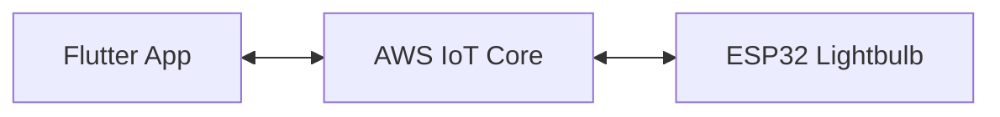

# IoT Lightbulb Controller

This project is a full-stack IoT solution consisting of a Flutter mobile application and an ESP32-based hardware controller. It allows users to remotely control a lightbulb using AWS IoT Core as the communication bridge.

## Project Architecture



1.  **Flutter App**: Acts as the user interface to toggle the light state. It communicates with AWS IoT Core using the MQTT protocol over WebSockets/TLS.
2.  **AWS IoT Core**: Serves as the message broker, handling secure communication between the mobile app and the hardware.
3.  **ESP32**: A microcontroller connected to a relay/LED. It subscribes to state changes from AWS IoT and updates the physical light status.

## Features

-   **Remote Control**: Toggle the light from anywhere with an internet connection.
-   **Real-time Feedback**: UI updates to reflect the current state.
-   **Secure Communication**: Uses TLS/SSL certificates for both Flutter and ESP32.
-   **Over-the-Air (OTA) Updates**: ESP32 supports remote firmware updates.
-   **Time Synchronization**: ESP32 uses NTP to sync time for certificate validation.

## Getting Started

### Hardware (ESP32)

The firmware is located in the `esp32/` directory.

**Requirements:**
-   Arduino IDE with ESP32 board support.
-   Libraries: `WiFi`, `WiFiClientSecure`, `PubSubClient`, `ArduinoJson`, `ArduinoOTA`.

**Setup:**
1.  Open `esp32/lightbulb.ino`.
2.  Create a `secrets.h` file in the same directory with your AWS IoT credentials:
    ```cpp
    #define THINGNAME "YourThingName"
    #define AWS_IOT_ENDPOINT "your-endpoint.iot.ap-south-1.amazonaws.com"
    static const char AWS_CERT_CA[] PROGMEM = R"EOF(...)EOF";
    static const char AWS_CERT_CRT[] PROGMEM = R"EOF(...)EOF";
    static const char AWS_CERT_PRIVATE[] PROGMEM = R"EOF(...)EOF";
    ```
3.  Update `ssid` and `password` in `lightbulb.ino`.
4.  Flash to your ESP32.

### Mobile App (Flutter)

**Requirements:**
-   Flutter SDK installed.
-   AWS IoT Certificates placed in `assets/certs/`.

**Setup:**
1.  Ensure the following certificates exist:
    -   `assets/certs/AmazonRootCA1.pem`
    -   `assets/certs/certificate.pem.crt`
    -   `assets/certs/private.pem.key`
2.  Update the `_endpoint` in `lib/iot_service.dart` with your AWS IoT Endpoint.
3.  Run the app:
    ```bash
    flutter run
    ```

## Project Structure

-   `lib/`: Flutter application logic.
    -   `main.dart`: UI implementation.
    -   `iot_service.dart`: AWS IoT MQTT integration.
-   `esp32/`: ESP32 firmware code.
-   `assets/certs/`: Directory for security certificates (Git ignored in production).
